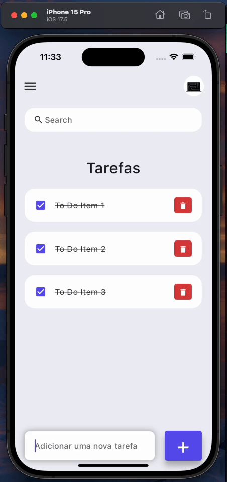

# ToDo List App

Projeto feito para estudar conceitos básicos do flutter como widgets, comunicação entre eles, controllers e estilização.

## Demonstração

### Getting Started

Para rodar o projeto na sua máquina é preciso ter algum emulador, dispositivo IOS ou Android disponível, também é necessário o SDK do flutter.
